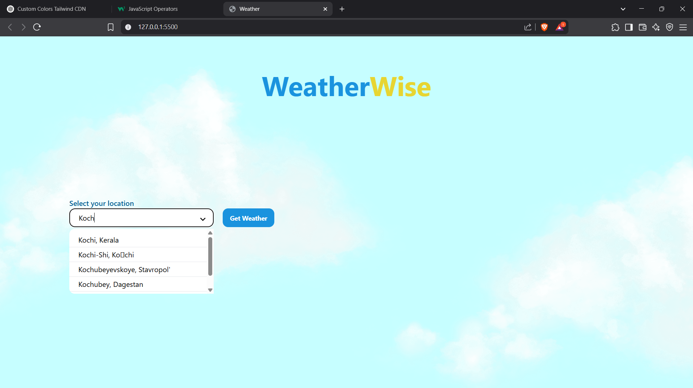
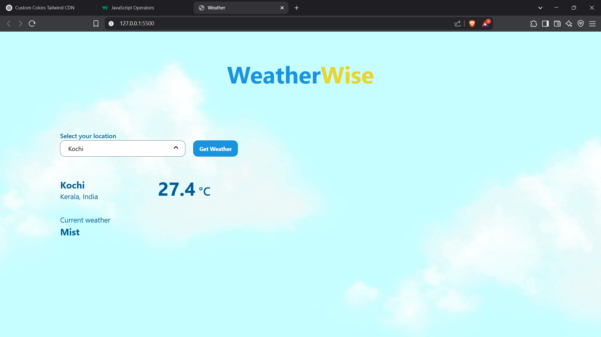

# WeatherWise

WeatherWise is a web application that provides real-time weather information for locations worldwide. The app features a dynamic UI that changes based on the time of day, creating an immersive user experience.

## Features

- **Real-time weather data**: Get current temperature and weather conditions for any location
- **Location search**: Search for cities worldwide with autocomplete suggestions
- **Dynamic UI**: Automatically changes appearance based on time of day (morning, evening, night)
- **Responsive design**: Works on desktop and mobile devices

## Technologies Used

- **TypeScript**: For type-safe JavaScript code
- **TailwindCSS**: For styling and responsive design
- **Weather API**: Real-time weather data from weatherapi.com
## How It Works

1. Enter a location in the search field
2. Select a location from the dropdown suggestions
3. Click "Get Weather" to retrieve current weather conditions
4. View the temperature and weather description for your selected location
